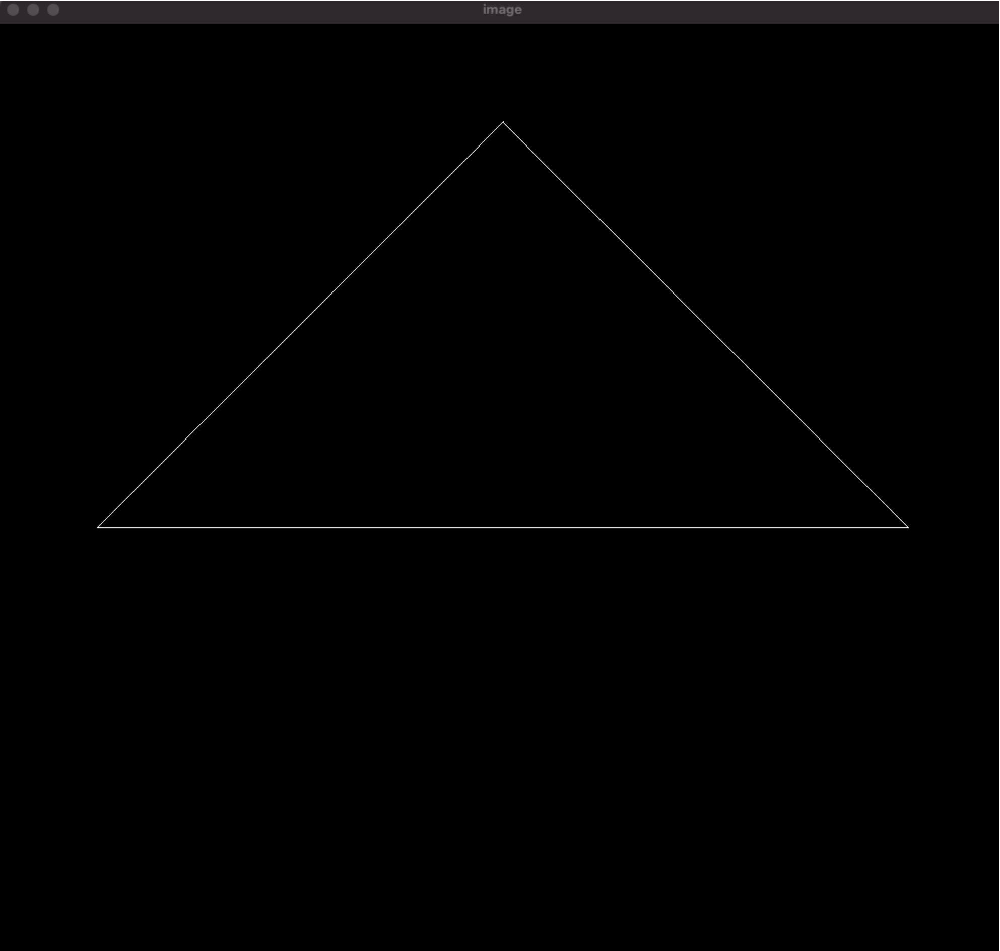
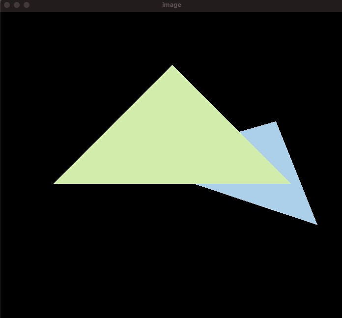

# Games 101

Personal study repo for UCSB Games 101

## Assignment 1



### Bonus

Rotation by angle $\alpha$ around axis $\vec{\text{n}} = (n_x, n_y, n_z)$

* By default, any $\text{n}$ will cross (0, 0, 0)

```C++
Eigen::Matrix4f get_rotation(Vector3f axis, float angle) {
    Eigen::Matrix3f I = Eigen::Matrix3f::Identity();
    Eigen::Matrix3f NNT = axis * axis.transpose();
    Eigen::Matrix3f A_star;
    A_star << 0, -axis[2], axis[1],
        axis[2], 0, -axis[0],
        -axis[1], axis[0], 0;
    Eigen::Matrix3f R = cos(angle / 180 * MY_PI) * I + (1 - cos(angle / 180 * MY_PI)) * NNT + sin(angle / 180 * MY_PI) * A_star;

    Eigen::Matrix4f rotate = Eigen::Matrix4f::Identity();
    rotate.block(0, 0, 3, 3) = R;
    return rotate;
}
```

## Assignment 2

* We need to change the initialization of depth buffer in `clear` function

```C++
std::fill(depth_buf.begin(), depth_buf.end(), -std::numeric_limits<float>::infinity());
```



### Bonus
