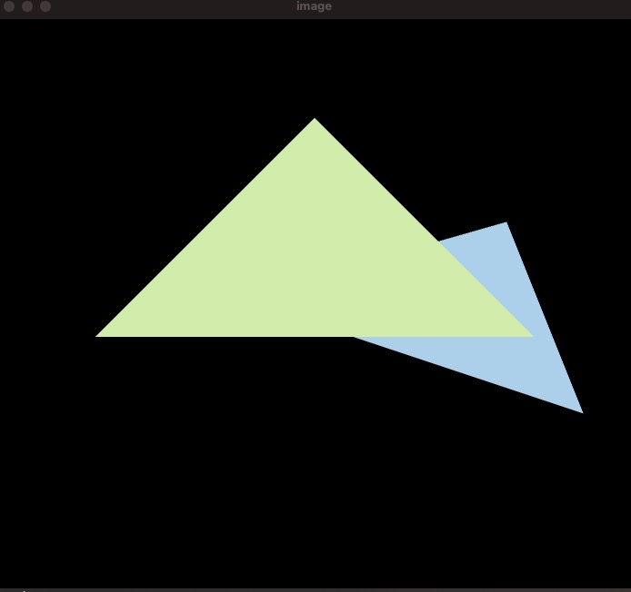
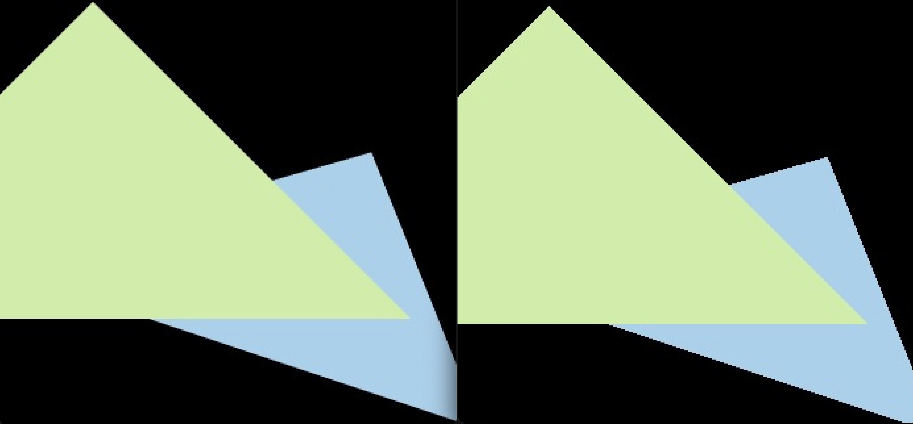
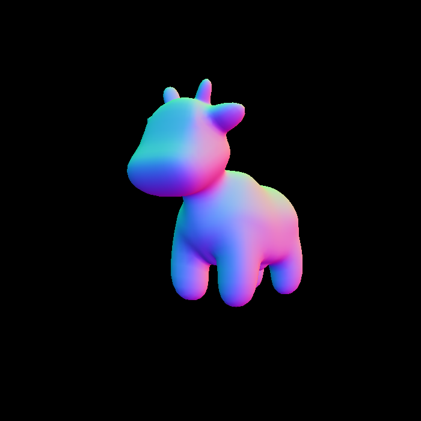
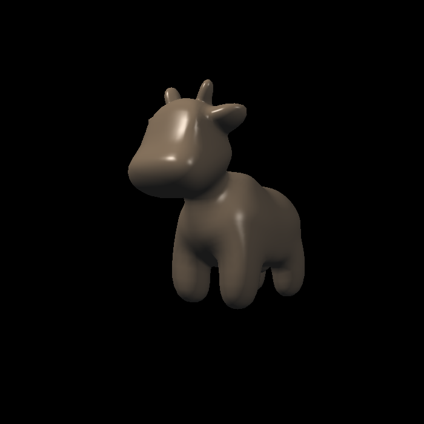
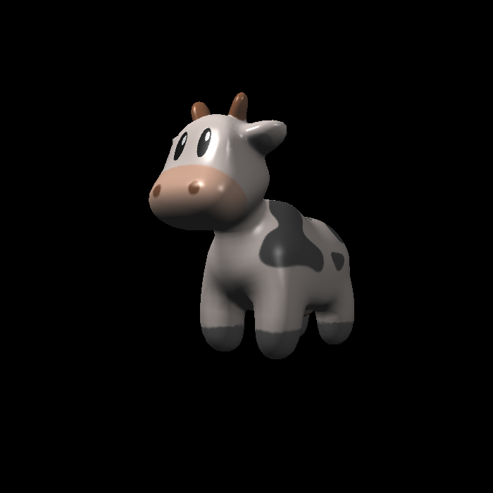
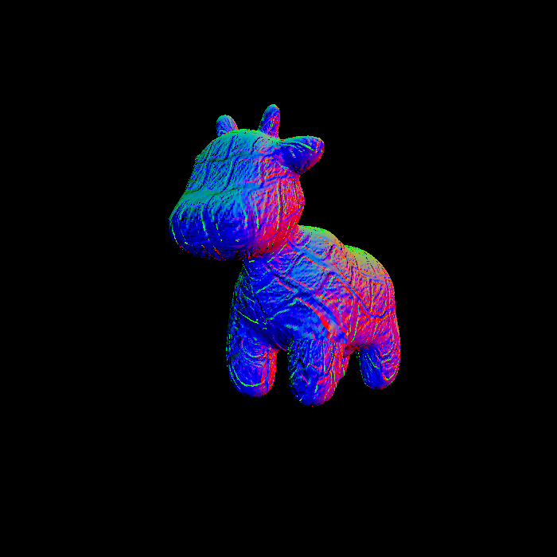
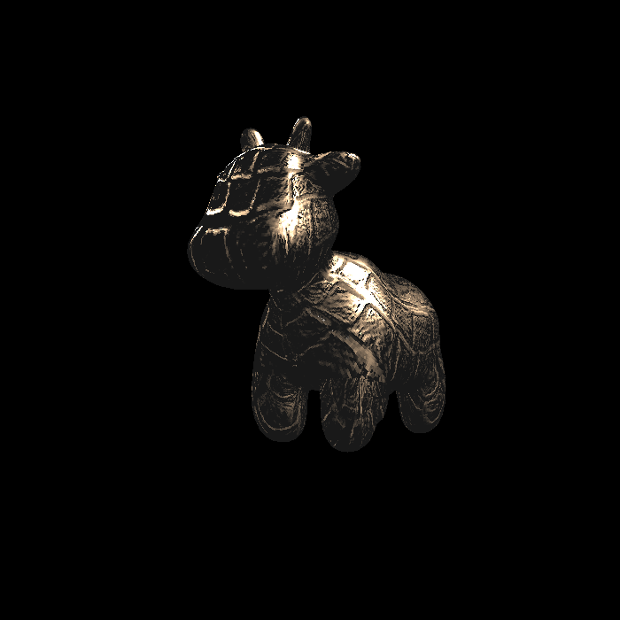
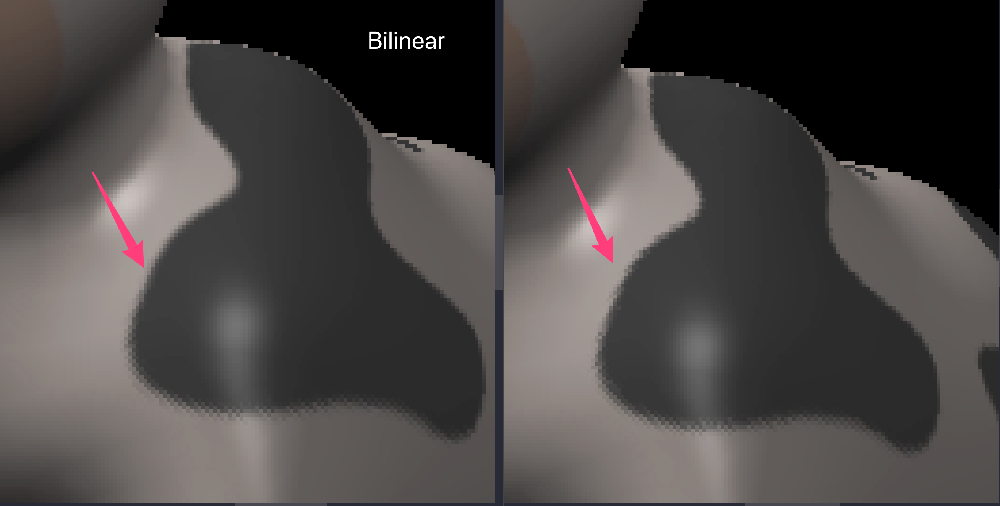
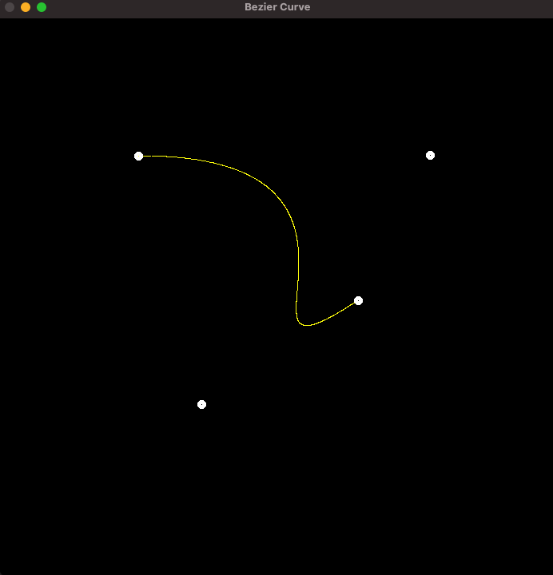

# Games 101

Personal study repo for UCSB Games 101

## Assignment 1

<p align="center">
    
</p>

### Bonus

Rotation by angle $\alpha$ around axis $\vec{\text{n}} = (n_x, n_y, n_z)$

* By default, any $\text{n}$ will cross (0, 0, 0)

```C++
Eigen::Matrix4f get_rotation(Vector3f axis, float angle) {
    Eigen::Matrix3f I = Eigen::Matrix3f::Identity();
    Eigen::Matrix3f NNT = axis * axis.transpose();
    Eigen::Matrix3f A_star;
    A_star << 0, -axis[2], axis[1],
        axis[2], 0, -axis[0],
        -axis[1], axis[0], 0;
    Eigen::Matrix3f R = cos(angle / 180 * MY_PI) * I + (1 - cos(angle / 180 * MY_PI)) * NNT + sin(angle / 180 * MY_PI) * A_star;

    Eigen::Matrix4f rotate = Eigen::Matrix4f::Identity();
    rotate.block(0, 0, 3, 3) = R;
    return rotate;
}
```

## Assignment 2

* We need to change the initialization of depth buffer in `clear` function

```C++
std::fill(depth_buf.begin(), depth_buf.end(), -std::numeric_limits<float>::infinity());
```

<p align="center">
    
</p>

### Bonus

```C++
void rasterize_triangle_ssaa(const Triangle &t);
void rasterize_triangle_ssaa2(const Triangle &t);
```

* Method 2: for a pixel on edges (cnt < 4), each pass, we clear its depth buffer to ensure both colors will be painted
* Reference: <https://zhuanlan.zhihu.com/p/454001952>

<p align="center">
     
</p>

## Assignment 3

* Change the initialization of depth buffer in `clear` function

```C++
std::fill(depth_buf.begin(), depth_buf.end(), -std::numeric_limits<float>::infinity());
```

* `getColorBilinear`

```C++
    Eigen::Vector3f getColorBilinear(float u, float v) {
        auto u_img = u * width;
        auto v_img = (1 - v) * height;
        auto u_left = (int)u_img;
        auto u_right = std::min(u_left + 1, width);
        auto v_top = (int)v_img;
        auto v_bottom = std::min(v_top + 1, height);
        auto u_ratio = u_img - u_left;
        auto v_ratio = v_img - v_bottom;
        auto color_top_left = image_data.at<cv::Vec3b>(v_top, u_left);
        auto color_top_right = image_data.at<cv::Vec3b>(v_top, u_right);
        auto color_bottom_left = image_data.at<cv::Vec3b>(v_bottom, u_left);
        auto color_bottom_right = image_data.at<cv::Vec3b>(v_bottom, u_right);

        auto color_top = color_top_left + (color_top_right - color_top_left) * u_ratio;
        auto color_bottom = color_bottom_left + (color_bottom_right - color_bottom_left) * u_ratio;
        auto color = color_bottom + (color_top - color_bottom) * v_ratio;

        return Eigen::Vector3f(color[0], color[1], color[2]);
    }
```

<p align="center">
        
</p>
<p align="center">

</p>

## Assignment 4

```C++
cv::Point2f recursive_bezier(std::vector<cv::Point2f> &control_points, int n, float t) {
    // Implement de Casteljau's algorithm
    if (n == 1)
        return control_points[0];

    for (int i = 0; i < n - 1; ++i) {
        auto point = (1 - t) * control_points[i] + t * control_points[i + 1];
        control_points[i].x = point.x;
        control_points[i].y = point.y;
    }

    return recursive_bezier(control_points, n - 1, t);
}

void bezier(const std::vector<cv::Point2f> &control_points, cv::Mat &window) {
    // make a copy of control points
    std::vector<cv::Point2f> points = control_points;

    for (double t = 0.0; t <= 1.0; t += 0.001) {
        // reset points
        for (int i = 0; i < points.size(); i++) {
            points[i].x = control_points[i].x;
            points[i].y = control_points[i].y;
        }

        auto point = recursive_bezier(points, points.size(), t);

        window.at<cv::Vec3b>(point.y, point.x)[1] = 255;
    }
}
```

<p align="center">
    
</p>
